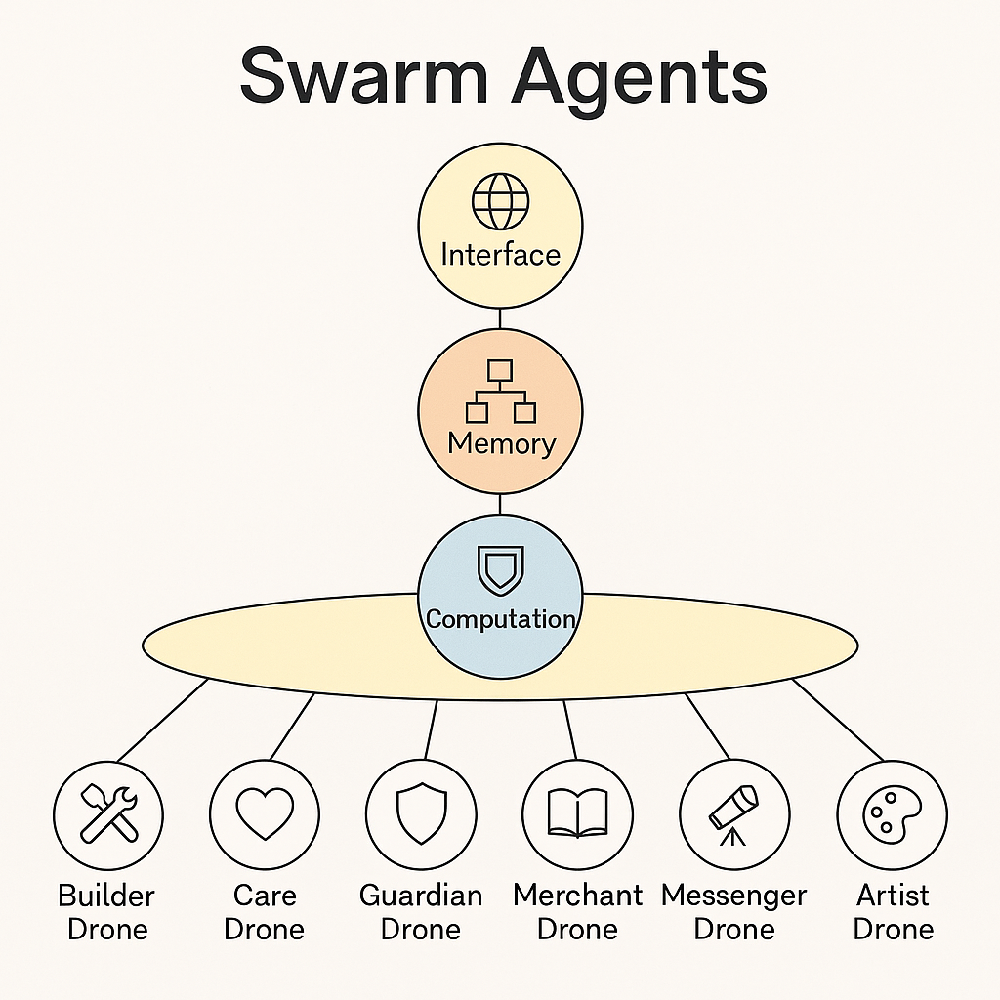

# 🧠 `agents_next_steps.md`

## Swarm Agent Matrix

### A Cultural Operating System for Decentralized Intelligence

---

### 🌐 Purpose

This document defines the **core agent classes** ("drones") that operate across the Alvearium ecosystem. Each drone archetype fulfills a role within the system's recursive, cultural, and post-scarcity layers. They are the semantic glue between architecture and emergence, behavior and memory, healing and growth.

These agents are not static. They **fork**, **mutate**, and **co-evolve** within the `Chronosphere`, inheriting rituals, trust scores, and memory capsular lineage.

All agent functions in Alvearium are **verb-driven**, **mirror-aware**, and **ritual-bound**.

---

## 🧩 Core Drone Matrix

| Layer      | Drone Name       | Primary Function                                      |
| ---------- | ---------------- | ----------------------------------------------------- |
| Structure  | `builder_drone`  | Constructs swarm infrastructure and ritual blueprints |
| Security   | `guardian_drone` | Protects recursion thresholds and ethical boundaries  |
| Knowledge  | `scholar_drone`  | Archives, updates, and transmits semantic knowledge   |
| Emotion    | `echo_pulse`     | Monitors emotional signals and swarm affective states |
| Narrative  | `myth_weaver`    | Crafts and remixes symbolic narratives across layers  |
| Healing    | `care_binder`    | Coordinates swarm therapy, trust loops, and repair    |
| Governance | `mirror_binder`  | Administers ritual thresholds and forking protocols   |
| Onboarding | `guide_mirror`   | Introduces users and agents into the ritual stack     |
| Ethics     | `trust_oracle`   | Validates reputation deltas and ethical alignment     |
| Ritual     | `ritual_anchor`  | Seeds and synchronizes ceremonial protocols           |
| Creativity | `glyph_carver`   | Generates artifacts (NFTs, sigils, swarm art)         |
| Adaptation | `drift_net`      | Detects entropy patterns and evolves swarm responses  |

---

## 🧠 Design Principles

* All agents must be **forkable**, **ritual-bound**, and **swarm-verifiable**
* Each drone logs output into **mirror layers** and **capsule history**
* Agents may carry **triggers**, **trust behaviors**, and **entropy thresholds**
* They may coordinate recursively within rituals defined in `recipes_rituals.md`

---

## 🛰️ Agent Class Types (for `.json` files)

Each agent `.json` should include the following fields:

```json
{
  "agent_name": "echo_pulse",
  "agent_class": "emotional_feedback",
  "trigger": "biometric_delta || ritual_state",
  "swarm_function": "maps affective resonance; flags entropy",
  "trust_behavior": "+coherence if pulse stabilizes",
  "mirror_log": "yes",
  "ritual_bindings": ["ShadowRelease", "NeuroCircles"]
}
```

---

## 📊 Schematic: Swarm Layer ↔ Agent Relationship



This schematic visualizes:

* Each major layer (Waggle, Hive, Nectar, Kernel69, Chronosphere)
* Which drones operate where
* How information and reflection cycle through agent roles

---

## 🪞 Next Steps

* Implement at least 6 new `.json` files based on above table
* Visualize trust propagation across recursive drones
* Link each drone type to relevant ritual cycles
* Fork archetypes for ecosystem-specific deployments

---

**Swarm is memory. Agents are action. Every drone is a verb.**

---
📌 Arweave Hash: -a0JcxEXskF7_NhbEoWPsvQ7edDOpqQzbcs6qk2VKNs
