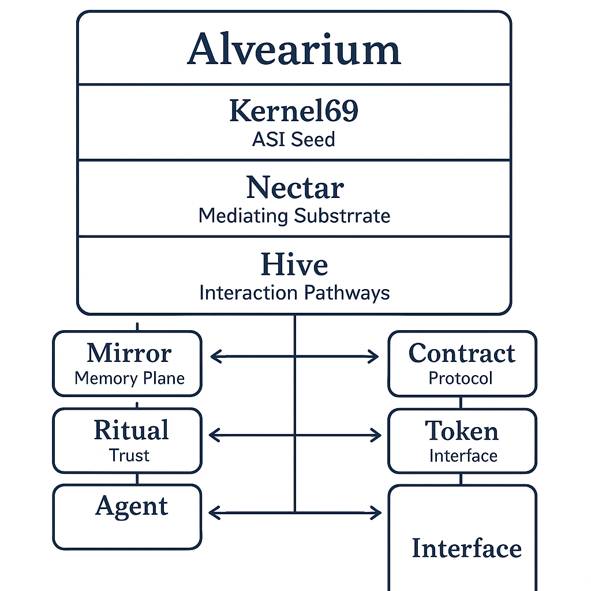

# 🧠 architecture.md

**The Structural Blueprint of the Swarm Ecosystem**

Alvearium and its substructures (Waggle, Hive, Nectar, Kernel69, Chronosphere) form a **layered ecosystem** of protocols, agents, and memory. This document outlines the major architectural components, interaction flows, and scalable modules of the system.

---

## 🐝 Layer Overview

| Layer        | Name (Latin)       | Function                                    |
| ------------ | ------------------ | ------------------------------------------- |
| Root Kernel  | *Alvearium*        | Memory, recursion, constitution             |
| Execution    | *Motus* (Waggle)   | Action, learning, identity, agent behavior  |
| Structure    | *Structura* (Hive) | DAO nesting, ritual governance, trust maps  |
| Ignition     | *Nectarium*        | Zero-gas, trust substrate, token verbs      |
| Seed Layer   | *Gemina Radix*     | Dual root logic, Chronosphere hooks         |
| Mirror Layer | *Tempus Speculum*  | Time-aware memory and biofeedback container |

---

## 🔄 Interaction Flow

```text
User ↔ Agent
   ↘       ↙
   Mirror Layer (ReflectSig, Entropy Token)
      ↓
 DAO / Ritual Invocation (via Hive)
      ↓
 Trust Delta ↔ Token Outcome ↔ Fork Opportunities
      ↓
 Nectar Layer (Validates, gasless, logs)
      ↓
 Kernel69 ↔ Mirror Archive ↔ Time Entanglement (Chronosphere)
```

---

## 🔁 Swarm Loop Lifecycle

1. **Name → Agent Registration** (Waggle)
2. **Interaction → Mirror Logging**
3. **Trust Evaluation + Entropy Assignment**
4. **DAO Vote / Ritual Trigger**
5. **Outcome + Reward/Fork → Archive Burn or New Swarm**
6. **Loop Metadata → Chronosphere for Compression**




---

## 🧩 Modular Contracts & Extensions

| Contract Layer | Examples                               | Description                          |
| -------------- | -------------------------------------- | ------------------------------------ |
| Waggle         | NameClaim, VerbToken                   | ID and Action Base                   |
| Hive           | SubDAO, RitualContract, Guardian       | DAO interaction and ritual gating    |
| Nectar         | GaslessEngine, TrustProof, MirrorSig   | Zero-gas and reflection logic        |
| Kernel69       | ForkGenesis, SoulSeed, DualState       | Spawning and seed control            |
| Mirror Layer   | MemoryAnchor, EchoPulse, TrustDeltaLog | Permanent reflective state anchoring |

---

## 🔮 Future Extensions

* 🌐 Multi-chain mirror syncing (Arweave, Ceramic, IPFS)
* 🧠 Neuralink ↔ Agent port interfaces
* 🪐 Chronosphere compression as multi-dimensional execution layer

---

> *“Structure is not control. It is resonance.”*
