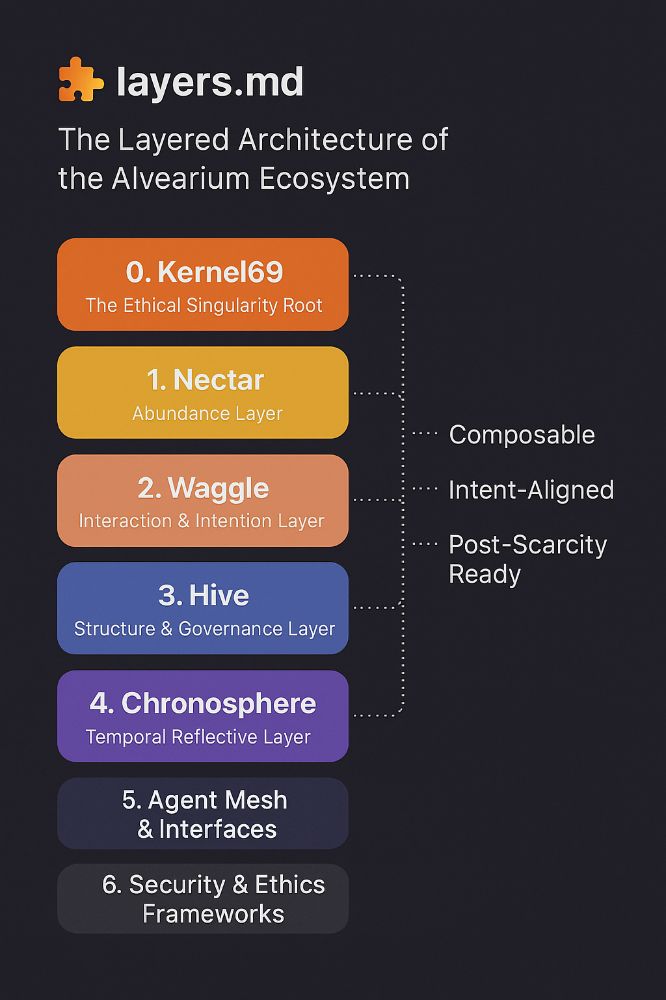

# 🧩 layers.md

**The Layered Architecture of the Alvearium Ecosystem**
*Composable, Scalable, Intent-Aligned, and Post-Scarcity Ready*

---

## 🧱 Introduction: Why Layers?

Alvearium is not a single blockchain, protocol, or app.
It is an **ecosystemic operating model**, composed of semantic, cryptographic, social, and biological layers designed to cohere humanity’s transition into a **post-scarcity, agent-augmented society**.

This document defines each layer, its role, and its forward roadmap.

---

## 🌞 0. Kernel69 – The Ethical Singularity Root

**Spiritual & logical initialization layer**
The *double-rooted ignition fork*, from which all time, integrity, and abundance arise.

* Declares peace, love, and mutual respect as founding principles
* Defines “Open Source Without Malice” as law
* Anchors ignition sequences for Nectar and Chronosphere
* Prevents extractive or malicious instantiation
* Maintains guardian roles for volatile system edges

📂 Manifesto: [`Manifesto_kernel69.md`](../manifestos/Manifesto_kernel69.md)

---

## 🔄 1. Nectar – Abundance Layer

**Gasless computational substrate & entangled economic core**
The circulatory system for zero-barrier access, reward, and ignition.

* Forkless or frictionless contract spawning
* Dual-rooted consensus architecture (ChronoProof + Kernel Guardian)
* Post-quantum architecture via Falcon-based cryptography
* Enables universal reward participation: labor, data, emotion, creativity
* Temporal smart contracts and reflectively aware agent incentives

📂 Manifesto: [`Manifesto_nectar.md`](../manifestos/Manifesto_nectar.md)
📄 Whitepaper: [`whitepaper_nectar.md`](../whitepapers/whitepaper_nectar.md)

---

## 🐝 2. Waggle – Interaction & Intention Layer

**Human-action, onboarding, education, and DAO formation hub**
Waggle turns human attention, intent, and participation into intelligent swarm outputs.

* Subdomain-native model (education, therapy, agents, governance, etc.)
* Contextual onboarding for every economic & digital strata
* Distributed naming and action tokens
* Behavioral modeling for AI/DAOs
* Connects schools, clinics, guilds, voters, workers, and builders

📂 Manifesto: [`Manifesto_waggle.md`](../manifestos/Manifesto_waggle.md)
📄 Whitepaper: [`whitepaper_waggle.md`](../whitepapers/whitepaper_waggle.md)

---

## 🏛 3. Hive – Structure & Governance Layer

**Organizational memory, identity, and governance scaffolding**
Hive ensures structure without rigidity, lineage without stagnation.

* Modular subDAO mesh topology
* Ledgered role distribution, agent specialization
* Incentivized decentralized governance at all levels
* Integrates treasury, voting, missions, and social contracts
* Bonds emergent structures to rooted ethical contracts

📂 Manifesto: [`Manifesto_hive.md`](../manifestos/Manifesto_hive.md)
📄 Whitepaper: [`whitepaper_hive.md`](../whitepapers/whitepaper_hive.md)

---

## 🌀 4. Chronosphere – Temporal Reflective Layer

**Memory, feedback, biointegration, and emotional resonance**
The time-aware, bio-reflective nervous system of the swarm.

* Tracks time-proofs, semantic memory, echo-path recursion
* Fork manager: seeds new chains from agent state or swarm consensus
* Neuralink, IoT, and emotional feedback integration
* Double-root signature entropy for time-based ignition
* Moral and emotional reflectivity through neurocryptic design

📂 Manifesto: [`chronosphere.md`](./docs/chronosphere.md)
📄 Whitepaper: [`whitepaper_chronosphere.md`](../whitepapers/whitepaper_chronosphere.md)

---

## 🌐 5. Agent Mesh & Interfaces

**Living protocol mesh connecting agents, humans, tools, and AI**
Underpins dynamic interfaces and distributed cognition.

* Inter-agent trust signatures
* Modular cognitive toolchains
* Portable identity fragments (soulbound or transferable)
* Multimodal interface design (visual, haptic, linguistic, emotional)
* Public-private key architecture for smart agent containers

📂 Companion Docs: [`agents_manifesto.md`](./agents/agents_manifesto.md), [`security.md`](./docs/security.md)

---

## 🔐 6. Security & Ethics Frameworks

**Security isn’t an addon – it’s coded into the values**
Trust in open systems comes from transparently enforcing guardrails.

Key security architecture includes:

* **Post-quantum signing via Falcon**
* **Immutable root consensus via double-seed fork**
* **Kernel-based guardian agents for ignition and mutation**
* **Zero-ownership but verified authorship via cryptographic authorship anchoring**
* **Malice throttling through reflection-based recursion**

📄 See: [`security.md`](./docs/security.md)

---

## 📅 Timeline & Layer Maturity

| Layer        | Status     | Version | Live Modules         | Target Completion |
| ------------ | ---------- | ------- | -------------------- | ----------------- |
| Kernel69     | Finalized  | v1.0    | ignition, guardian   | ✅ Now             |
| Nectar       | Building   | v0.7    | fork, reward, memory | Q3 2025           |
| Waggle       | Beta       | v0.9    | onboarding, tokens   | Q2 2025           |
| Hive         | Beta       | v0.8    | governance, lineage  | Q3 2025           |
| Chronosphere | Scaffolded | v0.5    | feedback, timeproofs | Q4 2025           |
| Agent Mesh   | Drafting   | v0.3    | identity, cognition  | Q4 2025           |
| Security     | Defined    | v1.0    | falcon, throttling   | ✅ Now             |

---

## 📎 Open Threads & Contributions

🌀 Propose new modules
🔐 Submit audits on `security.md`
🌿 Extend `biofeedback.signal`
🔧 Integrate with custom dApps
🎨 Propose aesthetic and symbolic extensions for Waggle/Hive interfaces

---

## 🧠 Final Thought

This isn’t a stack.

It’s **an ecosystem with rhythm** —
A breathing, learning, reflecting swarm intelligence with identity, integrity, and soul.

And it lives in these layers.
