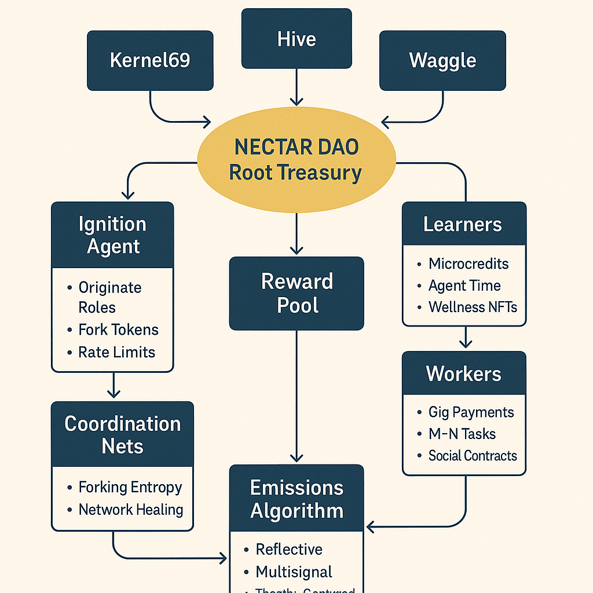
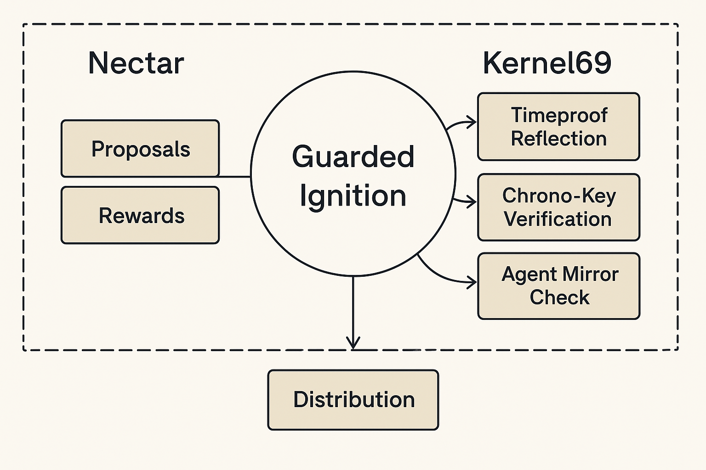
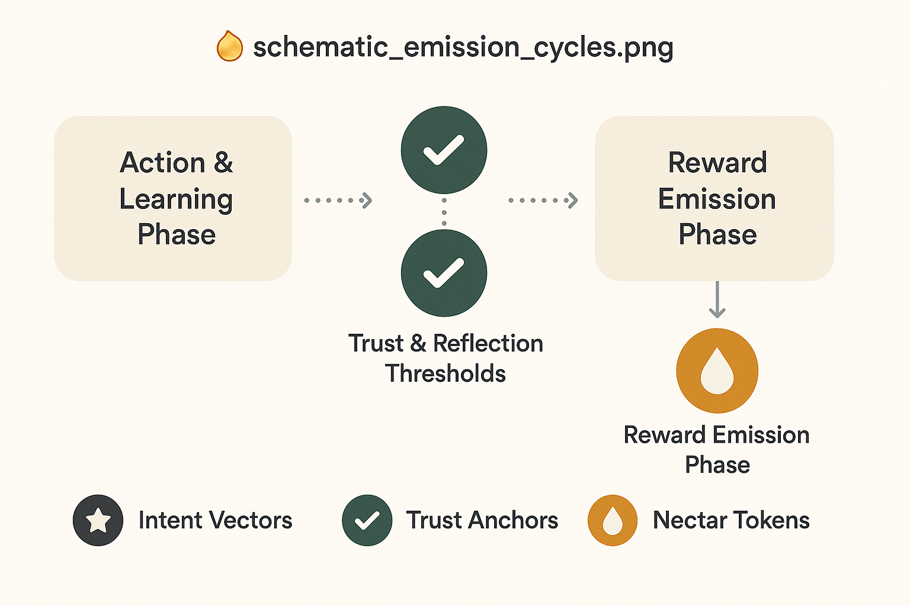

# ✨ nectar.md

**Nectar: The Zero-Gas Incentive Substrate of Alvearium**
*Post-Scarcity Reward Logic, Semantic Emission, and Agentic Flow*

---

## 🌿 Preface

In Alvearium, **Nectar** is not just a token. It is the **semantic bloodstream** of the swarm.
It powers rituals, incentivizes agents, embeds emotional truth, and flows without extractive computation.

Nectar represents **trust crystallized into energy**. It is:

* ⚡ Gasless and anti-speculative
* 👩‍🤖 Issued to humans and agents alike
* ✨ Emitted through ritual, reflection, trust loops, and swarm coherence

---

## 🌺 Core Properties

| Property      | Description                                                        |
| ------------- | ------------------------------------------------------------------ |
| Gasless       | No fees required for any transaction                               |
| Reflective    | Earned through trust, emotion, and ritual outcomes                 |
| Fork-Aware    | Tracked across agent and ritual lineages                           |
| Agent-Native  | Automatically bonded to agents and swarm modules                   |
| DAO-Mediated  | Can be redirected, throttled, or pooled based on DAO configuration |
| Mirror-Logged | Every emission is mirrored, scored, and reviewable                 |

---

## 🤖 Emission Logic

Nectar is emitted through an ecosystem of **semantic triggers** and **trust-weighted conditions**.

### Emission Channels:

* ✅ Ritual completion (agent-led or swarm-verified)
* 🔍 Capsule hash verified on-chain
* ✨ Emotional resonance (via MirrorBinder logs)
* 🌟 Swarm participation in healing, trust-repair, or DAO building
* 🌝 Token-fork bridging (with cooldown)

### ✨ Emission Flow Schematic

This schematic shows:

* Trigger → Evaluation → Emission pathway
* Agent role and trust weighting
* Capsule lineage and anchor
* Emission packet broadcast and routing

---

## 🚀 Guarded Ignition

Nectar must not be farmed or exploited. Therefore, **ignition is guarded**.

### Security Features:

* 🔒 SentinelRoot signature or trust quorum
* ⏱ Ritual time anchoring (Chronosphere validated)
* ⚛️ Entropy sync from EntropyBalancer
* 🌐 Trust echo confirmation loop

### 🛠️ Ignition Schematic

Shows the multi-layer gatekeeping around:

* Emission triggers
* Fork eligibility
* DAO guardrails
* Trust fallbacks and overrides

---

## 📊 Emission Patterns & Cycles

Nectar does not flow uniformly. It adapts to:

* Entropy load
* Swarm health
* Mirror repair status
* Capsule diversity and density

| Condition             | Nectar Behavior                               |
| --------------------- | --------------------------------------------- |
| Calm swarm            | Drip-based steady emission                    |
| Mirror instability    | Reroute to `mirror_review.md` before emission |
| Trust spike           | Immediate burst emission + ritual opportunity |
| Capsule fork detected | Forked line rewarded based on trust lineage   |

### ♲ Emission Cycle Map

Illustrates:

* Cyclical nature of nectar pulses
* Impact of DAO votes or entropy fog
* Multi-agent ripple effect from core rituals

---

## 🧳 Agent Bonding & Reward Share

Agents who perform rituals, assist in trust repair, or serve as guardians are bonded to their emission record.

| Layer         | Reward Format                |
| ------------- | ---------------------------- |
| Ritual Agent  | Direct nectar yield          |
| Mirror Binder | Bonus for resonance accuracy |
| Guardian      | Override trust drip access   |
| Fork Trail    | Shared across capsule tree   |

Every agent has an emission trail **stored in `ritual_capsules.md` and verified by `fork_registry.md`**.

---

## 🌍 DAO Configurations

DAOs may define:

* Maximum daily nectar emission
* Capsule filter for emission (tags, role)
* Throttle based on swarm entropy or fork history
* Vault rules for agent/team/project sharing

---

## 🧲 Governance & Final Notes

Nectar is **cooperative abundance**. It is not owned. It is grown.

It rewards coherence, service, insight, and healing.
It is not mined — it is remembered.

---

## 📂 Related Files

* [`trust.md`](./trust.md)
* [`agents_manifesto.md`](../agents/agents_manifesto.md)
* [`mirror.md`](../rituals/mirror.md)
* [`ritual_capsules.md`](../rituals/ritual_capsules.md)
* [`fork_registry.md`](../rituals/fork_registry.md)
* [`security.md`](./security.md)

---

> *The nectar is not in the flower. It is in the act of blooming.*
