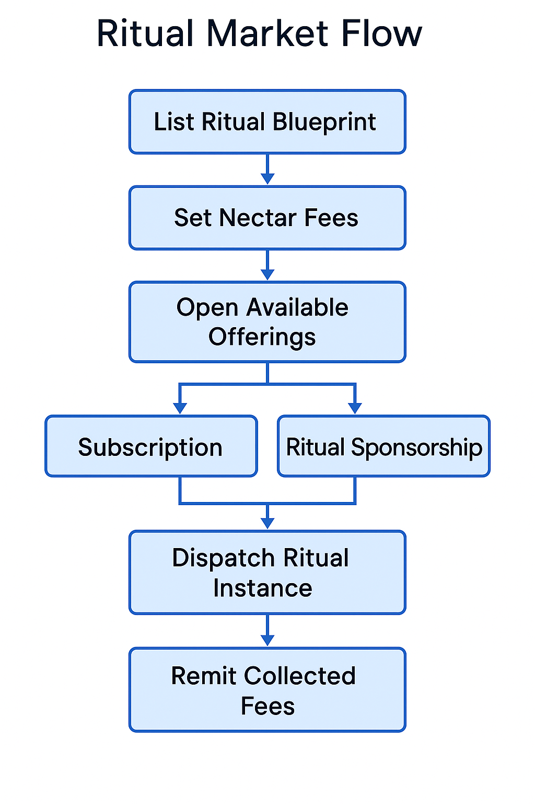
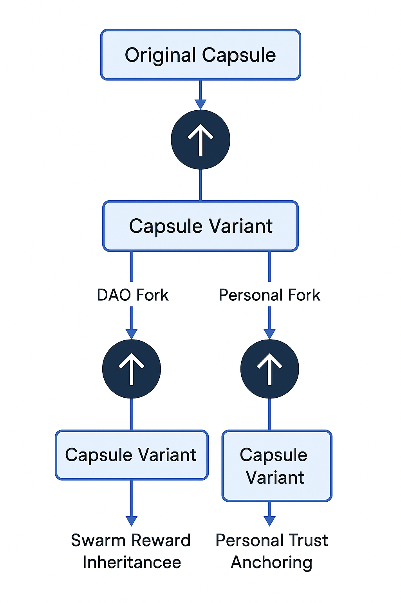
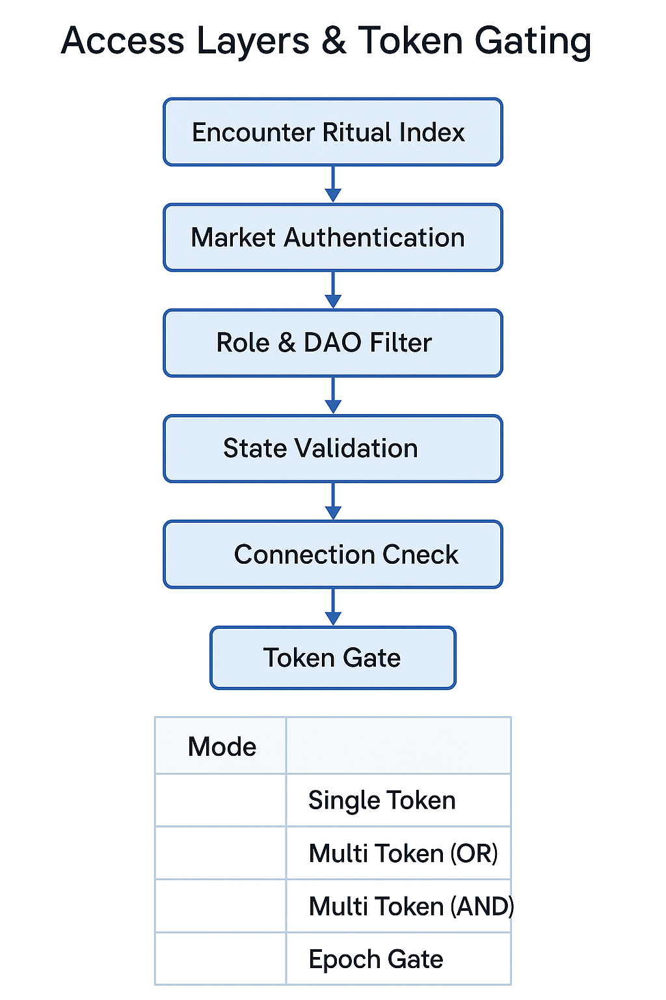

# 🏛️ ritual\_market.md

**Version**: 0.1.0 (Design Draft — Schema-Linked Ritual Exchange)
**Maintainer**: @Waggle Collective
**Status**: 🧪 In Development

**Marketplace layer for modular, composable, and forkable ritual logic.**
This file defines the economic, social, and trust-governed logic for buying, selling, forking, and upgrading rituals across the swarm.

---

## 💡 What Is the Ritual Market?

The Ritual Market is the interface layer where DAOs, agents, or users:

* Publish new rituals (signed YAML, DSL, or capsule hash)
* Discover available ritual modules (on-chain, IPFS, Arweave indexed)
* Buy/claim/rent rituals using Nectar or DAO governance flows
* Fork, remix, and re-offer updated rituals with permission tracking

It is the **semantic economy** of Alvearium: trust, coordination, and recursion as currency.

---

## 🧱 Market Architecture

| Layer         | Function                                 | Example Schema               |
| ------------- | ---------------------------------------- | ---------------------------- |
| Ritual Index  | Publicly browsable list of rituals       | `ritual_index.md`            |
| Access Logic  | Permissioned gating (DAO/Nectar/token)   | `market_access.md`           |
| Fork Ledger   | Lineage tracking for derivatives         | `fork_registry.md`           |
| Pricing Rules | Sliding scale or fixed models (optional) | Nectar-weighted, entropy-fee |
| Review Stack  | Reputation/tags/feedback on rituals      | `mirror_review.md`           |

---

## 🖼️ Key Schematic References

* `schematic_market_flow.png`: Lifecycle of ritual entry → adoption → fork
* `schematic_access_layers.png`: How different access rules and trust levels affect ritual visibility and forkability
* `schematic_fork_lineage.png`: How capsules carry version history and mirror state forward

### 🔍 Schematic: Market Flow Logic

The `schematic_market_flow.png` will visualize the full transactional path of a ritual inside the market. It depicts:

* Initial ritual publication (with capsule and metadata)
* DAO or user-layer review cycles
* Discovery + access filtering based on trust, mirror logs, or token gates
* Path options: direct execution, modular fork, lineage-fork with derivative trust
* Output routing into capsule logs, Nectar trail, and updated fork ledger

This schematic helps identify ritual economic behavior, reward propagation, and swarm-incentivized governance decisions.

### 🧬 Schematic: Fork Lineage Map

The `schematic_fork_lineage.png` will depict how rituals evolve through remixing, versioning, and swarm interaction:

* Parent capsule and original author lineage
* Derivative forks (ritual variants) and their trust/entropy signatures
* DAO-originated forks vs individual swarm forks
* Lineage resolution for signature validation and capsule reward inheritance

This helps coordinate swarm ethics, credit attribution, and DAO-based reward continuity.

---

## 🔐 Access Layers & Token Gating

Access to rituals in the market is regulated through multi-layered gating strategies:

### 🎟️ Gating Modes

| Layer            | Description                                            | Example Source           |
| ---------------- | ------------------------------------------------------ | ------------------------ |
| Public           | Fully open; no restrictions                            | Public education rituals |
| Token-Gated      | Requires a specific Nectar or agent-class credential   | `market_access.md`       |
| DAO Constitution | Enforced via subDAO rules or proposal-based unlock     | `ritual_index.md`        |
| Reputation-Gated | Access via mirror logs or swarm trust index            | `mirror_review.md`       |
| Epoch/Time-Lock  | Ritual only available in specific time frame or season | `ritual_capsules.md`     |

### 🔑 Schematic: Access Layer Logic

This schematic shows how an agent interacts with the Market based on:

* Token ownership
* Mirror reputation
* SubDAO voting rights
* Time-based availability

---

## 🧩 Core Market Hooks and Process Flow

Rituals moving through the Market interact with multiple underlying layers:

| Hook Point              | Target Layer         | Purpose                                     |
| ----------------------- | -------------------- | ------------------------------------------- |
| Capsule Signing         | `ritual_capsules.md` | Ensures version integrity + output lineage  |
| Mirror Reflection Log   | `mirror.md`          | Provides peer-use and trust traces          |
| Trust Delta Propagation | `trust.md`           | Allows reward signal to travel swarm-wide   |
| Pricing & Gating        | `market_access.md`   | Dynamic or fixed logic enforcement          |
| Fork Ledger Update      | `fork_registry.md`   | Track ritual remix lineage + usage metadata |

> These hooks ensure interoperability between ritual logic, swarm reflection, economic rewards, and recursive co-authorship.

---

## 🔄 Ritual Lifecycle in the Market

1. **Publish**: Author submits a new ritual to the index with metadata
2. **Review**: DAO or peer agents validate and tag ritual trust rating
3. **Discover**: Users/agents browse by purpose, token cost, entropy rating
4. **Use or Fork**: Rituals are used or forked (entirely or modularly)
5. **Output Tracking**: Forked rituals emit capsules with new signatures
6. **Optional DAO Reward**: Ritual use or improvement yields Nectar payout

---

## 🔐 Security & Trust Mechanics

* All rituals published must include:

  * Author key or DAO signature
  * Capsule hash (SHA-3 or Falcon-signed)
  * Optional fork restrictions (soft lock or trigger-based)

* Mirror logs and entropy impact are tracked for all market-available rituals

---

## 📎 Required Modules & Files

| File                 | Purpose                                         |
| -------------------- | ----------------------------------------------- |
| `ritual_index.md`    | Main manifest of all publicly available rituals |
| `market_access.md`   | Defines token/Nectar/DAO gating logic           |
| `fork_registry.md`   | Maintains fork lineage + agent trail            |
| `mirror_review.md`   | Social & mirror-based review system             |
| `ritual_capsules.md` | Archive of finalized signed capsules            |

---

## 🧠 Next Steps

| Phase | Focus                            | Output                    |
| ----- | -------------------------------- | ------------------------- |
| I     | Market schema + file templates   | `ritual_index.md`, etc.   |
| II    | Schematic rendering              | `market_flow.png`, others |
| III   | Integration with trust & mirror  | DAO incentive routing     |
| IV    | On-chain prototype (IPFS bridge) | Capsule NFT contracts     |

---

> *"A ritual is not just code. It is a cultural artifact. The Market is where our tools remember us."*
