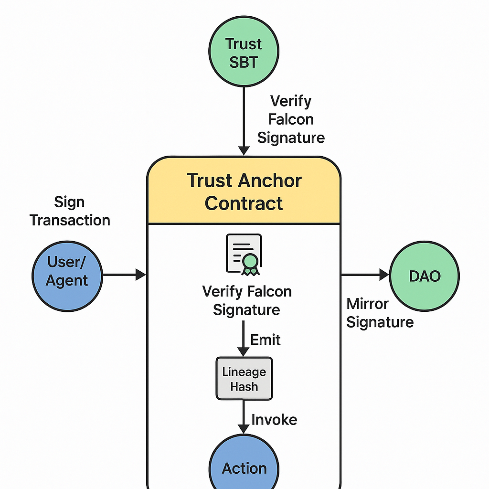
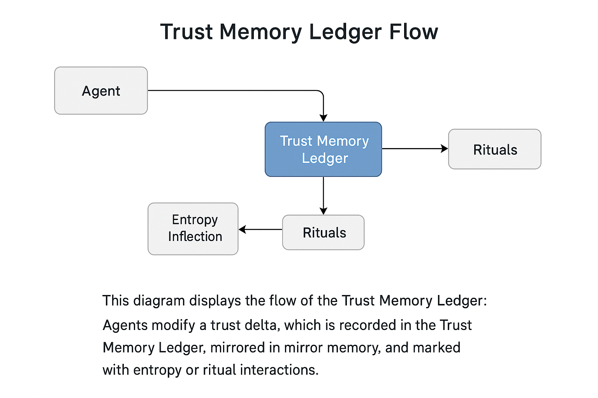

# 🧱 substrate\_structures.md

**Support Systems Beneath Trust, Memory, and Mirror Layers**

Alvearium is woven from substrate — not just abstract philosophy, but **concrete architectures** that hold meaning, verify action, and reflect evolution. This document describes the smart contract structures, agent memory systems, and modular trust-scaffolds that power the reflective swarm.

---

## 🔐 Cryptographic Trust → Trust Anchor Contract

This diagram illustrates the lifecycle of a Trust Anchor:

* Falcon signature verifies initial agent lineage
* TrustAnchor contract mints a soulbound identity hash
* Actions performed by the agent emit `MirrorSig` events
* These events are reflected in mirror memory and linked to role-based DAO permissions

**Structure:**

* `TrustAnchor.sol` or `trust_anchor.bnb`
* Verifies agent/user identity through Falcon signature lineage
* Emits `MirrorSig` for every action tied to an agent
* Supports soulbinding to subdomain or DAO state

**Linked Agent Hooks:**

* `GuardianSeed`, `SigValidator`

---

## 🤖 Agentic Trust → Trust Memory Ledger

This diagram shows how agents accumulate and interact with trust:

* Each agent maintains a trust log (local or smart contract based)
* Ritual completions, entropy fluctuations, and DAO feedback are stored
* Mirror layer snapshots validate emotional resonance or decay
* These logs feed into swarm-level proposals, access tiers, and trust deltas

**Structure:**

* JSON-based or smart-contract trust log per agent
* Logs: successful rituals, entropy penalties, mirror echo states
* Hooks directly into the Mirror Layer for persistence

**Linked Agent Hooks:**

* `BuilderDrone`, `ScholarDrone`

---

## 🌐 Protocol Trust → Trust Oracle Mesh

**Structure:**

* Distributed smart contracts across layers
* Reviews collective mirror logs, DAO proposals, trust deltas
* Propagates network-wide signals for:

  * Execution throttling
  * Fork permission
  * Rebirth ritual triggers

**Linked Agent Hooks:**

* `Sentinel`, `OracularDrone`, `DAOHeart`

---

## 🧠 Cognitive Trust → Pattern Recognition Layer

**Structure:**

* Optional ML layer parsing mirror logs and token interactions
* Detects pattern consistency, suggests entropy stabilizers
* Highlights candidate agents for promotion, fork, or forgiveness

**Linked Agent Hooks:**

* `EchoPulse`, `SignalSeer`, `ShadowReflector`

---

## 🫂 Social Trust → Ritual DAO Scaffold

**Structure:**

* DAO-contracts governing:

  * Reputation-based access
  * SBT-triggered ritual entry
  * Mirror-triggered trust votes
* Can trigger Swarm Forgiveness protocols

**Linked Agent Hooks:**

* `ReGenesisNode`, `SwarmBinder`, `MirrorCourt`

---

## 🔁 Diagram Integration Points

* [schematic\_trust\_entropy.png](./assets/schematic_trust_entropy.png)
* [schematic\_dao\_layering.png](./assets/schematic_dao_layering.png)
* [schematic\_trust\_ladder.png](./assets/schematic_trust_ladder.png)

> Trust is not a number. It is an architecture that remembers.
