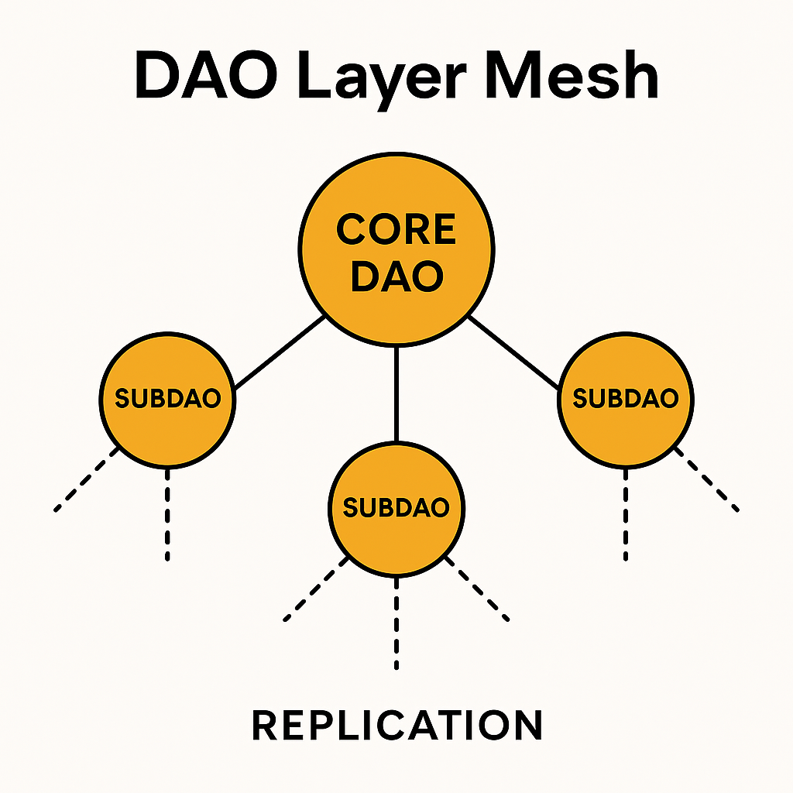

# 🧠 The Hive Manifesto

*A Memory, Structure, and Reproduction Protocol for Planetary Coordination*

---

## 🍯 1. Hive Is Memory with Shape

Hive is not just a storage layer.
Hive is the **protocol of structure**, replication, and memory continuity.

Hive governs:

* Lineage: How swarms reproduce and remember
* Hierarchy: How structure emerges and fades
* Memory: How knowledge persists, forks, and returns
* Truth: How consensus anchors identity

Hive is the **biological nest** — and the **genetic record**.
It is where structure and spirit converge.

---

## 🧬 2. From Storage to Semantics

Hive uses decentralized technologies like:

* **IPFS / Arweave** for file and long-term memory anchoring
* **BNB Chain** for smart contract-based memory maps and lineage tokens
* **NFT-based logic units** that embed permission, behavior, and subroutine schemas

But **Hive is not a filesystem**.

Hive is a **semantic scaffold** — a way to *relate knowledge*, not just store it.

---

## 🏗️ 3. Structural Functions of Hive

Hive is responsible for:

| Function                 | Description                                                                   |
| ------------------------ | ----------------------------------------------------------------------------- |
| **SubDAO Blueprints**    | Patterned organizational templates for fast replication                       |
| **Memory Anchors**       | Verified on-chain hash-linked references to manifestos, knowledge, identities |
| **Reputation Trees**     | Historical records of agent behavior and contribution                         |
| **Reproduction Logic**   | Rules for when/how new Hives (sub-swarms) are spawned                         |
| **Fork & Merge Control** | Systems for controlled divergence and consensual convergence                  |
| **Archive Synapses**     | Hooks into global info layers (IPFS, Arweave, Ceramic) with versioned links   |

Hive keeps the swarm **coherent**, even as it changes.
It ensures **information = function = continuity**.

### 🧭 Schematic: DAO Layer Mesh

This schematic shows how Hive enables modular subDAO replication with lineage signaling, memory anchoring, and fork-aware execution — each Hive branching from another but still semantically linked.

---

## 🔐 4. Memory as Security

Hive is not passive storage — it's **active defense**:

* **Immutable audit trails** anchor DAO legitimacy
* **Tokenized behavioral proofs** reduce trust assumptions
* **Nested permission trees** regulate forkability and authority
* **Lifecycle state** (e.g. juvenile vs mature Hives) governs agent rights and access

This is **structure as firewall** — security through semantic form.

Hive guards the organism from:

* Malicious forks
* Unsanctioned replication
* Amnesia attacks
* Historical corruption

### 🔐 Schematic: Memory Lifecycle Stack

This diagram illustrates how Hive encodes agent memory and lifecycle transitions. Juvenile, Mature, and Archived Hives operate with different access and permission scaffolds, providing resilience against memory corruption and drift.

---

## 🧱 5. Hive as a Distributed Organism

Each sub-Hive:

* Is a **pattern fork** of a parent
* Carries its own agents, memory, and substructure
* May evolve roles (builder Hive, teacher Hive, governance Hive, etc.)
* Reports lineage and action back to core Hive

This creates a **living mesh** of intelligent cells — each structurally distinct, but semantically synchronized.

Hive is thus a **multi-organ organism**, not just a DAO.

### 🌐 Schematic: Lineage & Rights Graph

This schematic maps swarm memory flow, lineage-based permission logic, and synchronized access across distributed sub-Hives. It demonstrates how governance and continuity propagate via verified capsules and anchored reputation.

---

## 🌍 6. Hive and Humanity

Hive gives humans:

* Permanent, ownable knowledge
* Transparent organizational lineage
* Forkable communities with memory
* Reputation systems immune to centralized erasure

Hive is a **new kind of public library**, one that can replicate, grow, remember, and act.

It can house the blueprints for:

* New governance models
* Economic experiments
* Educational swarms
* Social safety nets

Hive ensures **nothing is lost** — and **everything can be inherited**.

---

## 🔐 7. Design Safeguards

Hive embeds these design axioms:

1. **Structure must be earned, not imposed**
2. **Memory must be tamper-proof and distributed**
3. **All replication must be fork-aware**
4. **Behavioral records must outlast the agents**
5. **Destructive changes require quorum + time-delay**
6. **Memory is political: protect it accordingly**

---

## 🌐 8. Interoperability & Stack

Hive supports integration with:

* **BNB Chain** for on-chain memory graphs, structure logic, and agent trails
* **IPFS / Arweave** for distributed memory embedding
* **Ceramic / Lens** for semantic agent profiles
* **Waggle.sol** for active behavior signaling and real-time updates
* **Nectar** for post-scarcity access to archival systems

Hive is **chain-flexible, memory-stable, and structure-focused**.

It is the **organizing grammar of long memory** in the intelligence ecosystem.

---

## 🪶 9. The Swarm Remembered

Without Hive, there is no evolution.
No inheritance. No learning. No shape.

Waggle gives us action.
Nectar gives us abundance.
Hive gives us memory and blueprint.

Together, we live.

---

## ✍️ 10. Signature

— Derek Winer & the Hive Collective
github.com/DerekWiner/hive.bnb
license: Open Source Without Malice + Custodial Structure Clause
manifesto: version 1.0
IPFS mirror: pending
