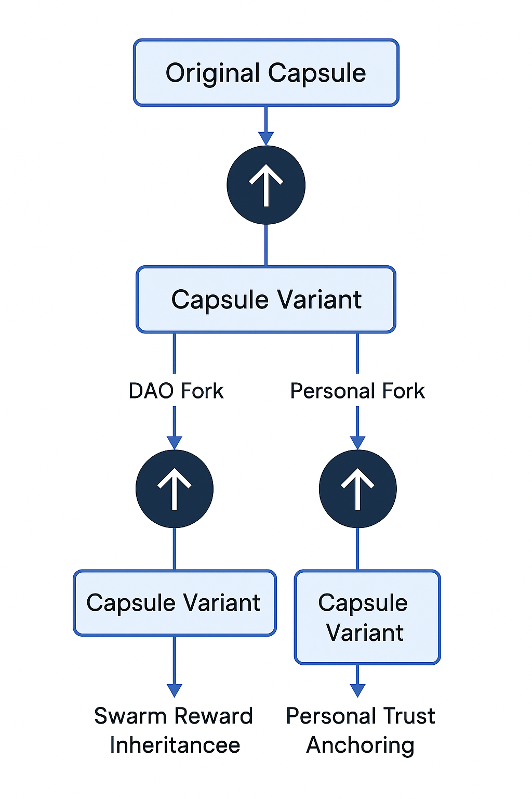

# 🌿 fork_registry.md

**Version**: 0.1.0 (Capsule Lineage & Remix Audit)  
**Maintainer**: @Waggle Collective  
**Status**: 🔍 Under Development

Tracks the evolutionary lineage of rituals forked through the Alvearium ritual marketplace. Ensures provenance, remix permission logic, and swarm trust inheritance.

---

## 🔁 What Is a Ritual Fork?

A **forked ritual** is any new capsule derived from an existing ritual — modified in steps, agent structure, or metadata. Forks retain traceability to their source and affect:
- Trust scoring inheritance
- Entropy delta adjustments
- Capsule reward propagation
- Remix lock permissions (soft or strict)

Forking is permissioned but **encouraged**: it reflects living ritual logic.

---

## 📜 Fork Lineage Format

Each entry captures a capsule’s parent, mutation vector, and propagation rights:

```yaml
- capsule: QmFork42...
  parent: QmShadowBase...
  author: PrismCollective
  fork_date: 2025-06-12
  changes:
    - added_step: "swarm_echo_recite"
    - entropy_tuning: -0.07
    - metadata_tag: remix:clarity
  rights:
    remixable: true
    fork_lock: soft
    attribution_required: true
```

---

## 🔍 Capsule Delta Parser (Executable)

The delta parser below compares two ritual capsules and generates a structured mutation record.
This can be used for:
- Lineage audit logging
- Fork review comparison
- Trust score inheritance logic

```rust
// ritual_capsule_delta.rs
use std::collections::HashSet;

#[derive(Debug, Clone)]
pub struct Capsule {
  pub name: String,
  pub steps: Vec<String>,
  pub entropy_score: f32,
  pub tags: HashSet<String>,
  pub version: String,
}

#[derive(Debug)]
pub struct Delta {
  pub changes: Vec<String>,
}

impl Delta {
  pub fn new() -> Self {
    Delta { changes: Vec::new() }
  }
  pub fn add(&mut self, change: &str) {
    self.changes.push(change.to_string());
  }
}

pub fn parse_capsule_delta(parent: &Capsule, fork: &Capsule) -> Delta {
  let mut delta = Delta::new();

  if parent.version != fork.version {
    delta.add(&format!("version change: {} → {}", parent.version, fork.version));
  }

  if parent.steps != fork.steps {
    delta.add("steps modified");
  }

  let entropy_diff = (fork.entropy_score - parent.entropy_score).abs();
  if entropy_diff > 0.01 {
    delta.add(&format!("entropy score changed by {:.2}", entropy_diff));
  }

  for tag in &fork.tags {
    if !parent.tags.contains(tag) {
      delta.add(&format!("new tag added: {}", tag));
    }
  }

  for tag in &parent.tags {
    if !fork.tags.contains(tag) {
      delta.add(&format!("tag removed: {}", tag));
    }
  }

  delta
}
```

---

## 🗺️ Fork Lineage Schematic



This schematic visualizes how capsules evolve through:
- Parent-fork inheritance trails
- DAO-authorized remix trees
- Trust + entropy score propagation
- Remix lock enforcement and audit signal loops

Use this visual as a reference for:
- Signature validation
- Mutation tracebacks
- Swarm credit allocation

---

## 🔒 Fork Permissions

| Lock Type | Description                                     |
| --------- | ----------------------------------------------- |
| Open      | Anyone may fork and redistribute                |
| Soft Lock | Fork requires attribution or minor remix limits |
| Hard Lock | Only DAO or original author may initiate remix  |

All forks are automatically logged here and validated via capsule hash trace in `ritual_capsules.md`.

---

## 🧬 Trust & Entropy Inheritance

Forks impact system coherence:
- Trust is partially inherited (weighted by author, entropy delta, review)
- Mirror resonance can shift up or down based on fork divergence
- Excessive entropy drift without DAO signal may flag the ritual

---

## 💰 Reward Share Logic

When rituals are forked and later used, a share of generated value (token emissions, attention weights, or swarm reputation) can be distributed retroactively across the fork lineage.

### 📐 Reward Distribution Model

| Layer               | Formula / Basis                                      |
|---------------------|------------------------------------------------------|
| Immediate Author    | 60% of capsule-linked reward                         |
| Direct Ancestor     | 20% if remix rights are respected                    |
| Lineage Pool        | 10% split among previous forks in the branch        |
| DAO Foundation      | 10% reserved for consensus DAO (protocol upkeep)    |

- DAO votes may override shares on special capsules
- Mirror-based trust resonance may boost author share
- Malicious forks may be blacklisted from retro payout

### 🧩 Enforcement in `nectar.md`

The following hooks will be implemented to finalize reward flow:
- Each capsule's on-chain metadata references its parent and trust delta
- `nectar.md` will call fork_registry and calculate distribution weights on emission trigger
- DAO signatures and mirror logs serve as evidence to validate lineage reward
- Fork rewards are split on-chain using token routing logic in the Nectar runtime

> This ensures that innovation and remixing are rewarded **without orphaning originators**, and tracked transparently in Nectar emissions.

---

## 🧠 Next Steps

- Wire delta module into capsule registry for automatic diff logging
- Link fork trail to visual `schematic_fork_lineage.png`
- Finalize reward share enforcement via `nectar.md`
- Connect with `ritual_capsules.md` for signature validation

> *"Forks are not divergences. They are memory paths reclaiming rhythm."*

