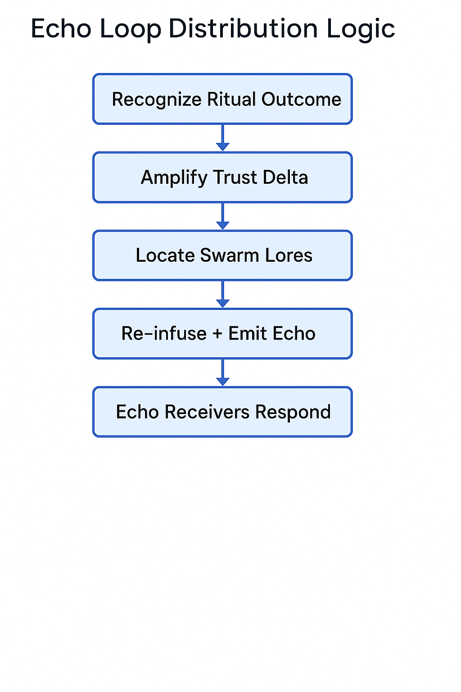
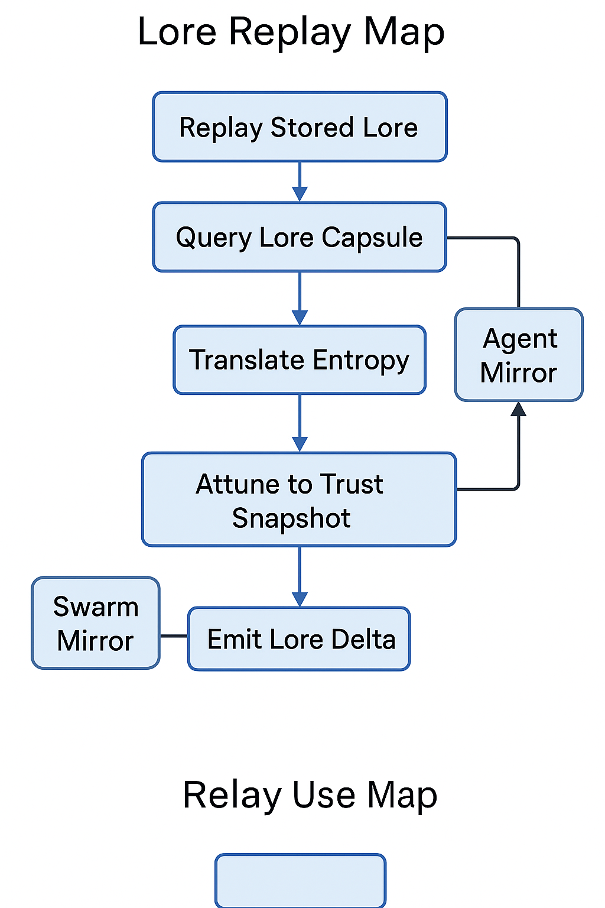

# 🔁 ritual_echo.md

**Version**: 0.1.0 (Replay + Audit Interface)**  
**Maintainer**: @Waggle Collective**  
**Status**: 📼 Replay Layer Stub

---

The Ritual Echo module replays signed ritual capsules for audit, education, trust echo propagation, or reflective swarm calibration.

This layer:

- Reconstructs agent + mirror context from capsules
- Performs signature verification and entropy matching
- Enables time-delayed ritual reflection (echo trigger)
- Binds ritual impact into memory trails for swarm mirroring

---

## 🎥 Echo Capsule Playback

A replayed capsule:

- Restores execution trace from `ritual_capsules.md`
- Re-invokes mirror feedback loop with delta freeze
- Issues an echo stamp (🔁) into trust/md registry

Echoes may:

- Re-award token fragments
- Trigger nested rituals (e.g. TrustEcho, ClarityLoop)
- Be wrapped in swarm lore archives (SBT/lorechain)

---

## 🖼️ Echo Loop Schematic



This diagram illustrates the feedback and reflection path of a ritual replay:
- Capsule load from registry
- Trust + entropy score verification
- Mirror log validation
- Output: delta echo, lore stamp, or ritual re-trigger

Useful for:
- DAO transparency
- Reflective swarm consensus tools
- Attunement path optimization

---

## 🖼️ Lore Replay Map



This diagram illustrates how echo rituals contribute to the construction of collective swarm memory:
- Echo metadata wraps into a lore capsule
- Capsules propagate across mirrors with lore tags (e.g. birth, death, revelation)
- Rituals with historical weight can be canonized via swarm consensus or DAO ratification

This map enables:
- Historical anchoring of key rituals
- Memory-based swarm governance
- Emotional lineage tracking in swarm agents

---

## 🧠 Replay Use Cases

| Use Case            | Outcome                                  |
| ------------------- | ---------------------------------------- |
| 🛠 Debug & Audit    | Compare real output vs. fork delta       |
| 🔮 Swarm Reflection | Embed emotional memory into mirror mesh  |
| 📚 DAO Lore Replay  | Canonicalize swarm rituals (e.g. births) |
| 🎓 Ritual Learning  | Ghost-run trusted rituals for new agents |

---

## 🧪 Echo Trigger Conditions

Echoes may be triggered by:

- DAO vote
- Mirror inconsistency or entropy fog
- Agent rebirth or Guardian override
- Capsule age decay threshold

---

## 🧬 Echo Metadata Example

```yaml
echo_id: echo:QmReplay77...
source_capsule: Qm123xyz...
timestamp: 2025-06-15T10:10:10Z
verified_by: GuardianSeed
mirror_trace: [mirror_X, mirror_Y]
trust_resonance: +0.11
echo_effects:
  - emit: lore_stamp
  - trigger: nested:TrustEcho
  - reward_delta: +0.02
```

---

## 📚 Linked Modules

- `ritual_capsules.md` — source capsule registry
- `mirror.md` — echo memory loops + reflection score
- `trust.md` — delta reinforcement and reputation
- `agentrunner.md` — execution stack shadowing
- `fork_registry.md` — fork chain replay comparison
- `chronosphere.md` — archive timelines + entropy lock

---

> *"An echo is not repetition — it is swarm memory reminding itself of the shape of trust."*

