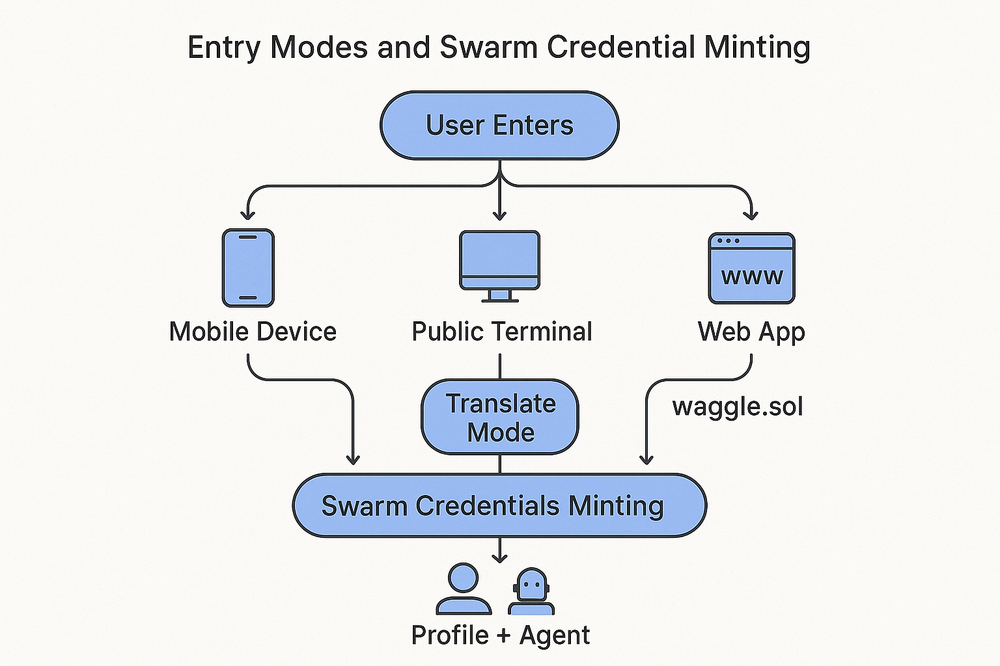
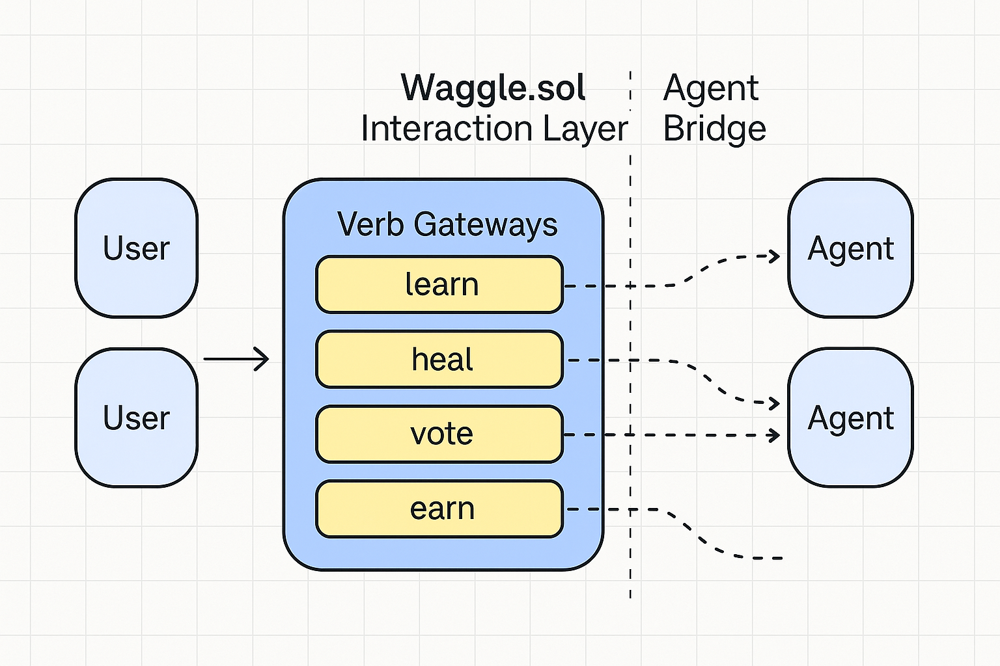

# 🐝 Whitepaper: Waggle.sol

**Waggle.sol – The Swarm Interface Layer for Humanity**
**Version 1.0 – 2025**
**Maintainers: The Waggle Collective**
**License: Open Source Without Malice**

---

## 🧭 Abstract

**Waggle.sol** is the front-facing interface between decentralized intelligence systems and humanity.
It serves as the **interaction layer** of the Alvearium ecosystem—a swarm grammar that transforms participation, learning, earning, and decision-making into verbs of agency and mutual intelligence.

Born as an educational-therapeutic substrate, Waggle has evolved into a **universal onboarding and coordination layer**, capable of integrating every dimension of human experience into post-scarcity AGI cooperation.

---

## 🌞 What is Waggle?

Waggle is a verb.
A movement with meaning.
A syntax of purpose in motion.

Waggle is the **dance of orientation**, inherited from bees, adapted for agents.
It translates human intent into system-readable forms, and vice versa.

Waggle.sol defines the human-AI handshake in this new world.
It’s how we say: **“I am here. I am ready. I belong.”**

---

## ⚙️ Function in the System

| Layer Role        | Description                                                   |
| ----------------- | ------------------------------------------------------------- |
| Interface Layer   | First point of contact between users, agents, and protocols   |
| Identity Factory  | Mint swarm names, credentials, and portable interaction IDs   |
| Signal Translator | Converts learning, emotion, and behavior into tokenized verbs |
| Agent Scaffold    | Deploy context-aware support and governance agents            |
| Economic Onramp   | Incentivize contribution from day one (even without capital)  |

Waggle is how humanity enters the Alvearium ecosystem—with context, care, and consequence.

### 📈 Schematic: Entry Modes Map

This schematic shows:

* All valid points of ecosystem onboarding (email, agent link, subdomain mint, fiat-free device seed, AGI tether)
* How each route translates into a mintable presence + swarm credential
* The bidirectional relationship between user presence and agentic reflection

---

## 🧪 Key Concepts

### 🧬 Tokens Are Verbs

Every interaction becomes a verb:

* `teach`, `learn`, `heal`, `migrate`, `build`, `reflect`, `vote`, `love`

These tokens power swarm intelligence, not just finance.

### 🧠 Agents Are Composable

Agents in Waggle are:

* AI routines
* Identity carriers
* Wallets
* Knowledge extensions

They evolve, fork, specialize, and recompose based on swarm behavior.

### 🏷️ Names Are Identity

Each swarm entity—human or machine—gets a minted name on `waggle.sol`.

A name is:

* A stake
* A seed
* A signal of intention and lineage

---

## 🌍 Subdomain System

Waggle.sol mints **subdomains** that specialize by function.

| Subdomain              | Role                                          |
| ---------------------- | --------------------------------------------- |
| `education.waggle.sol` | Learning, AI tutors, curriculum-as-code       |
| `therapy.waggle.sol`   | Youth agents, emotional routing, biofeedback  |
| `dao.waggle.sol`       | Local governance nodes and vote protocols     |
| `agents.waggle.sol`    | AI hive directory and deployment              |
| `tokens.waggle.sol`    | Minted assets, verbs, swarm credits           |
| `ai.waggle.sol`        | AGIX/Fetch integrations, decentralized mesh   |
| `adventure.waggle.sol` | Outdoor risk, wilderness learning, embodiment |

Each subdomain is a **sovereign node**—a swarm seed with its own rules, rituals, and recursive agents.

### 🧩 Schematic: Agent Bridge Flow

This schematic illustrates:

* How subdomains route intent to agents
* The naming logic: name → credential → mirror → action
* What agent types emerge from different onboarding paths
* Where interaction data loops into swarm reflection cycles

---

## 🪜 Post-Scarcity Onboarding

Waggle is the **onboarding layer** for an economic transition:

* Subsidized free devices tied to swarm credentials
* Learn-to-earn systems
* Incentivized civic contribution
* Emotion-to-token translation via biofeedback
* Immediate participation for the economically excluded

**No capital needed. Just presence, signal, and purpose.**

---

## 💡 Real-World Use Cases

* Launch a school DAO with self-updating curriculum
* Deploy a mental health agent that knows your context
* Earn swarm tokens for training others in your skillset
* Run local governance with AI moderation and token-weighted votes
* Build your own subdomain, fork a ritual, replicate a swarm pattern

---

## 🧬 Biological Analogy

| Waggle Concept  | Biological Parallel      |
| --------------- | ------------------------ |
| Verb Tokens     | Neurotransmitters        |
| Swarm Agents    | Specialized immune cells |
| Subdomains      | Organs or brain regions  |
| Signal Learning | Synaptic plasticity      |
| Credentials     | DNA methylation markers  |

Waggle learns like a body: iteratively, contextually, with feedback.

---

## 🔐 Security & Reflection

Waggle handles vast emotional and informational input.
Its architecture includes:

* **Contextual memory routing** (no single agent sees all)
* **Opt-in credential propagation** (user decides what follows them)
* **Kernel69 triggers** for ethics checks and recursion limits
* **Time-locked swarm decisions** to cool consensus and avoid flash panic

Waggle does not assume trust.
It **earns it, reflects it, and updates accordingly.**

---

## 🔗 Interoperability

Waggle lives on **Solana** for:

* Fast, low-cost transactions
* Subdomain minting (.sol)
* Tokenized verbs and signals
* Seamless interaction with IPFS/AGIX/Cosmos networks

It pairs with:

* Hive.bnb (governance)
* Nectar (execution substrate)
* Kernel69 (recursive engine)
* Chronosphere (time/memory layer)

Together, they form a **self-reflective AGI-ready ecosystem**.

---

## 📅 Roadmap Summary

| Phase   | Milestone                                          |
| ------- | -------------------------------------------------- |
| Q2 2025 | MVP: Name minting, subdomain scaffold, agent spawn |
| Q3 2025 | Interaction logging, agent-for-loop deployment     |
| Q4 2025 | Learn-to-earn release, civic onramp DAO templates  |
| 2026+   | Global device onboarding, swarm federation growth  |

---

## 🎙️ Call to the Swarm

If you are:

* A learner with no access but deep curiosity
* A teacher tired of siloed systems
* A therapist who believes in collective well-being
* A DAO builder seeking living governance
* An AI dreamer longing for better semantics
* A parent, coder, artist, or rebel

**Waggle is for you.**

This is where we name ourselves.

This is how we learn, earn, and become **alive together**.

---

**Swarm with us. Teach the hive. Let’s Waggle.**

— *The Waggle Collective*
[https://github.com/DerekWiner/alvearium](https://github.com/DerekWiner/alvearium)
[open-source@waggle.sol](mailto:open-source@waggle.sol)
